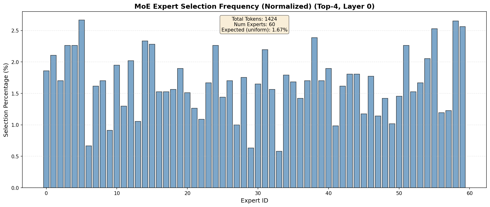

# MoE Expert Tracking for vLLM

## Directory Structure

This directory contains the complete deliverables for the MoE expert tracking implementation:

```
EXPERT_TRACKING_DELIVERABLES/
├── README.md                      # This file - project overview and results
├── AI_USAGE.md                    # Documentation of AI tool usage and verification
├── MOE_ROUTING_ANALYSIS.md        # Detailed analysis tables (top/bottom experts)
├── run_generate.py                # Script to run inference with tracking enabled
├── generate_expert_hist.py        # Script to generate histogram visualization
├── moe_routing_analysis.py        # Script to compute entropy and generate analysis
├── make_prompts.py                # Utility to extract prompts from dataset
├── prompts.txt                    # 25 GSM8K prompts used for testing
├── moe_routes.jsonl               # Raw expert routing logs (5696 selections)
├── expert_hist.png                # Histogram visualization of expert usage
└── timing.jsonl                   # Performance comparison (with/without logging)
```

**Tests:** Unit tests are located in [test_expert_tracking.py](../tests/kernels/moe/test_expert_tracking.py)

## Implementation Details

The core tracking module is located in [expert_tracking.py](../vllm/model_executor/layers/fused_moe/expert_tracking.py).

**1. MoE Expert Selection Hook** - [unquantized_fused_moe_method.py](../vllm/model_executor/layers/fused_moe/unquantized_fused_moe_method.py)
- Lines 362-363: Check if MoE expert logging is enabled and initialize tracker if needed.
- Lines 370-380: Hook inserted after `select_experts()` to record topk_ids and topk_weights before fused_experts computation.

**2. Warmup (Dummy) Run Suppression** - [gpu_model_runner.py](../vllm/v1/worker/gpu_model_runner.py)
- Lines 3840 & 4073: State checks added to suppress tracking initialization/running during warmup/profiling `_dummy_run` operations, ensuring logging only occurs during actual prompt processing.

**3. Model ID Capture** - [llm_engine.py](../vllm/v1/engine/llm_engine.py)
- Lines 170-172: Function added to capture and pass model name at initialization time.

## Running the Code

```bash
# Enable expert tracking (set to empty string to disable)
export VLLM_LOG_MOE="moe_routes.jsonl"
export VLLM_LOG_MOE_LAYER="0"
export VLLM_LOG_MOE_SEED="1234"

# Run inference with tracking (from repo root directory)
python run_generate.py

# Generate histogram visualization (from repo root directory)
python generate_expert_hist.py moe_routes.jsonl expert_hist.png

# Generate & save histogram (from repo root directory)
python moe_routing_analysis.py moe_routes.jsonl
```

## Testing

Run the unit test suite to verify the implementation:

```bash
# From repo root directory
python tests/kernels/moe/test_expert_tracking.py
```

The test suite validates:
- Tracker initialization and configuration
- JSONL output format and metadata
- Layer filtering (only target layer tracked)
- 3D tensor handling (batch flattening)
- Suppression mechanism (warmup/dummy runs)
- Model ID capture in metadata

## Results

**Top-3 Most Used Experts (Overall):**

| Rank | Expert | Count | Percentage |
|------|--------|-------|------------|
| 1 | 5 | 152/5696 | 2.67% |
| 2 | 58 | 151/5696 | 2.65% |
| 3 | 59 | 146/5696 | 2.56% |

**Model:** Qwen/Qwen1.5-MoE-A2.7B-Chat (Layer 0, Top-4, Seed 1234, 1424 tokens)



**Normalized Distribution:** All 60 experts used, ranging from 0.58% to 2.67% vs uniform expectation of 1.67%.

**Entropy:** H = 5.84 bits (98.9% of max). The high entropy indicates a well balanced router that is ensuring no single expert is being overused. Interestingly, despite the selection of experts being nearly uniform, when looking at the frequency of experts selected as the number 1 expert, it suggests some specialization (selection percentage as top expert ranges from 0.07% to 4.56%)

See [MOE_ROUTING_ANALYSIS.md](MOE_ROUTING_ANALYSIS.md) for complete breakdown including bottom-3 experts and first-choice preferences.
